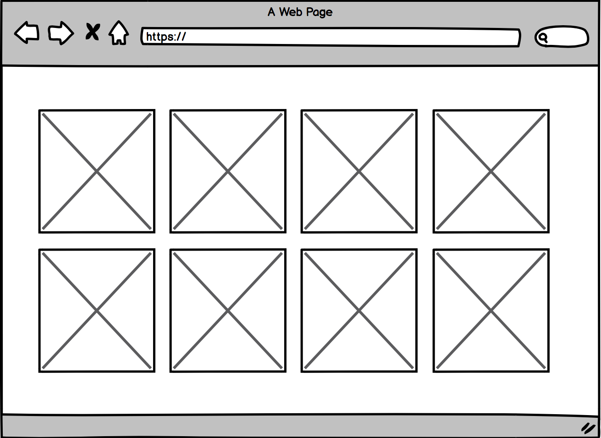
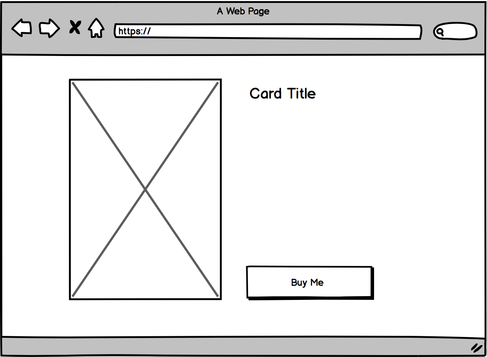

# Frontend Technical Challenge

We've been asked to rebuild the Moonpig website using the latest best practices and you are part of a team working on the proof of concept. We'd like you to build out a simple page which will display a list of cards that a customer can buy using our API.

It should meet the following use cases:

> As a customer I can view a list of availble cards on my mobile, tablet and desktop so that I can celebrate my new job

> As a customer I can view more details of a card so that I can decide it's the right card for me before purchase

## Wireframes

### Card Listings Page



### Card Details Page



Possible ideas for extension are the ability to search, routing, pagination, responsive images and animation. However, doing less "well" is preferable to doing more "less well" 😉. We also appreciate that your free time is important. Therefore if you feel your code is unfinished please leave some notes in your README.md explaining what you would do next given more time. We are more than happy to review this.

## API

### Search Cards

```
curl "https://search.moonpig.com/api/products?size=20&fq=card_shop_id:1"
```

### View Card

```
curl "https://www.moonpig.com/uk/api/product/product/?mpn=pu1162"
```

> Note: replace `pu1162` with the variable `MoonpigProductNo` from the first API call

## Tools, libraries and frameworks

We are beginning to use React at Moonpig so ideally the exercise would also be written in React. However, it's not a deal breaker and we are happy to receive exercises written with your library of choice or even vanilla JS.

Primarily we will be looking at the application code itself - so it's fine to use something like [Parcel](https://parceljs.org/) or [Create React App](https://github.com/facebook/create-react-app) to bootstrap your build. But if tooling is your thing, there's bonus points for rolling your own build system with Webpack, Babel etc.

It should be possible to statically host the application and it would be great to see it hosted on something like GitHub Pages or AWS S3.

## Assessment

We will assess the task based on the following criteria:

- How clean, modular and extensible the code is
- How it looks visually and the techniques used to style the application
- Responsive web design techniques used
- Accessibility
- Approach to testing
- Anything that goes above and beyond
